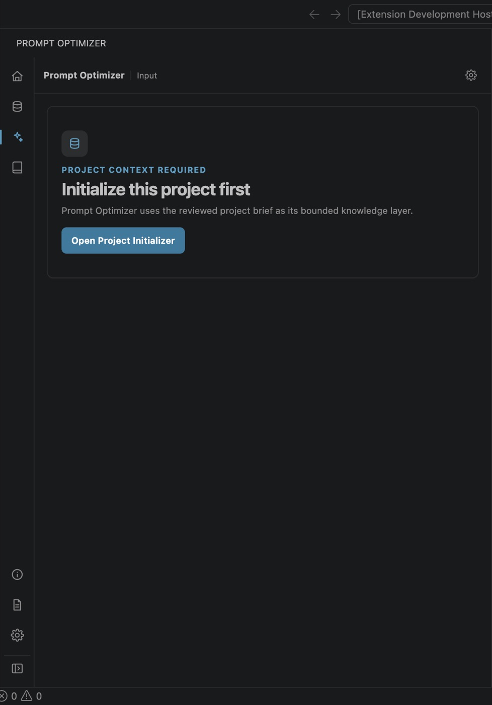
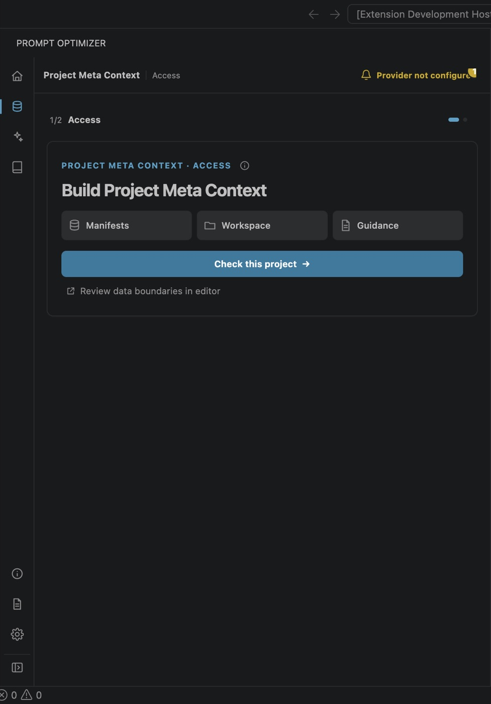
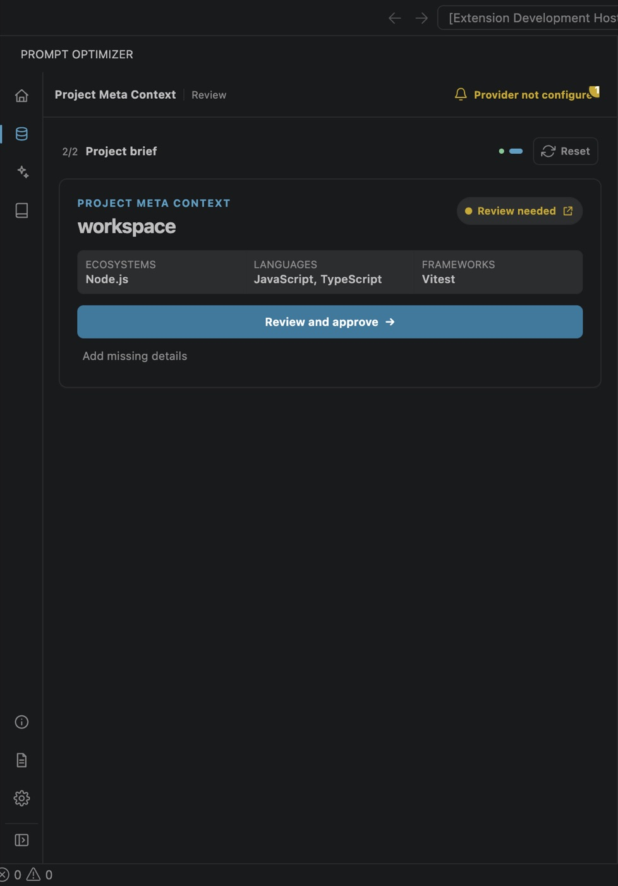
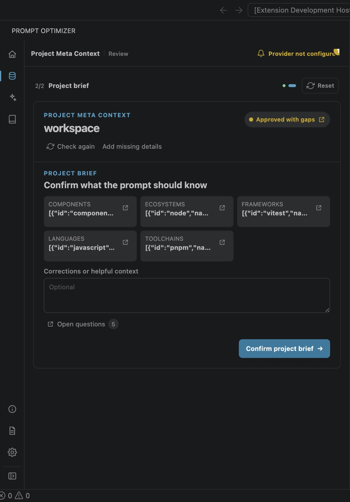
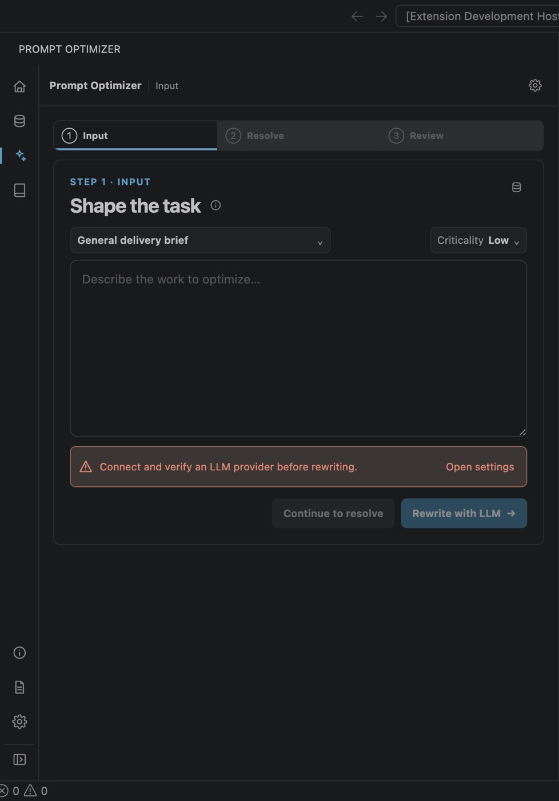
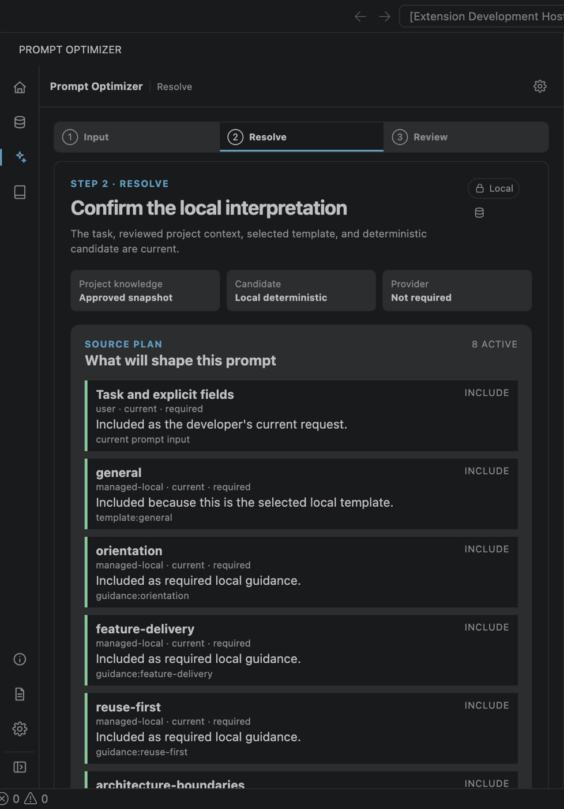
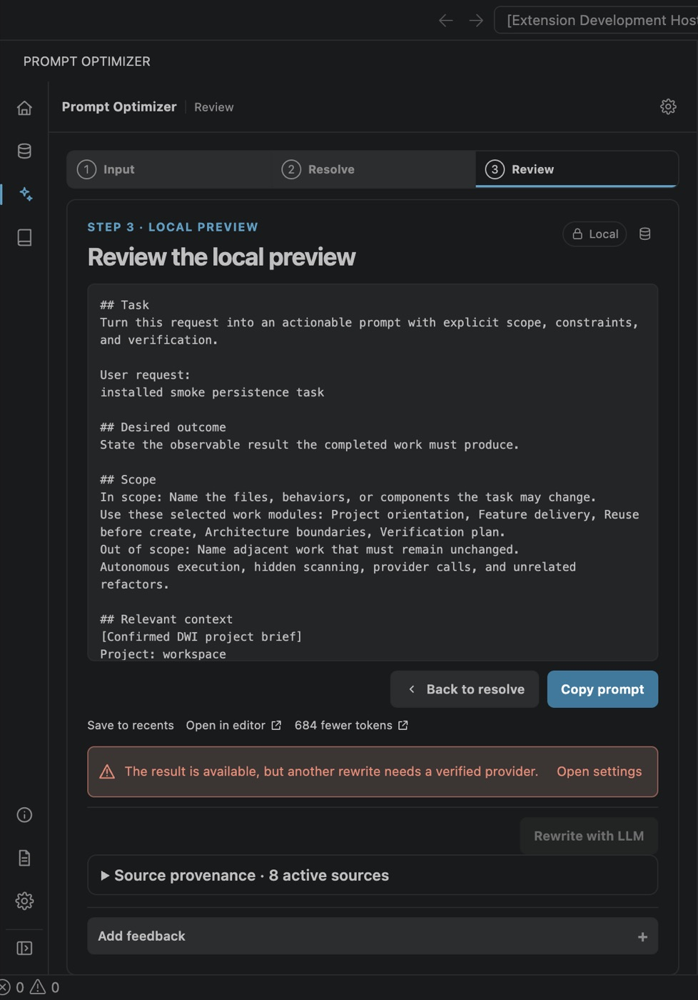

# Temporary Prompt Optimizer plugin walkthrough

This temporary document shows the installed Prompt Optimizer plugin running inside an isolated VS Code profile and a synthetic TypeScript workspace. Every image was captured directly from the packaged plugin on 1 September 2026. These are not mock-ups, generated illustrations, or images of internal programme documents.

The walkthrough uses the local deterministic path. It makes no external AI call and contains no user, customer, credential, or production-project data.

## 1. Project context is required

Prompt Optimizer does not begin project-aware prompt work until the project has been initialized.

## 2. Bounded project check

The plugin explains what it will inspect before the developer starts the bounded local check.

## 3. Review collected project facts

The developer reviews the locally collected project evidence before it can become approved context.

## 4. Approve the project brief

The reviewed brief is confirmed before Prompt Optimizer may use it as the project's knowledge layer.

## 5. Describe the task

The Input step starts only after project initialization. This capture uses a synthetic test task.

## 6. Confirm the local interpretation

Resolve shows the approved project snapshot, deterministic candidate, provider status, and the sources shaping the prompt. The provider is explicitly shown as not required.

## 7. Review the local preview

The Review step presents the deterministic result for developer review and saving.

## Evidence boundary

This walkthrough demonstrates the installed, provider-free initialization and Input → Resolve → Review journey on the captured build. It does not establish live-model quality, production readiness, external-service authorization, or independent user acceptance. The screenshots are temporary review material and should be removed when the walkthrough is no longer needed.
